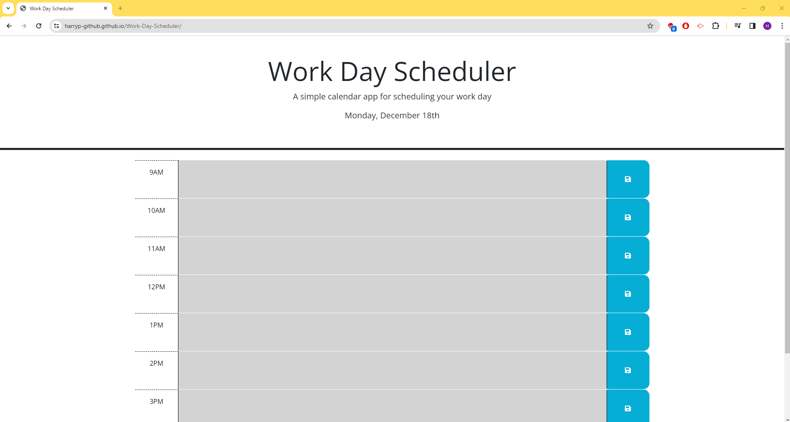

# Work Day Scheduler

## Description

This project was to create a Work Day Scheduler, which would help the employee organise their busy schedule. The main feature of the project was to be able to add events that would occur between the work hours so the employee could manage their time efficiently. Additional features was the date would be added to the top of the page, there would be hourly blocks for the workday, the time blocks were colour coded, white, red and green indicating which is in the past, present and future and the save button would save the event to local storage, so when it is refreshed it will still be on the page. A final additional feature was that when the save button was pressed, a notification would come up confirming the appointment is saved.

## Installation

N/A

## Usage

To use this page, navigate through the time blocks and enter in what events are occuring throughout the day. As the day goes on, notice that the colours of the time blocks will change depending on if it is in the past, present or future. When you save your event, notice the notification that the event has been saved to local storage. Finally, refresh the page to see the save events still in the time blocks.

## Credits

Page made by me.

Info from Internet sources + Teachers/Class Material

Particularly the [Day.js library](https://day.js.org/en/) and [format](https://day.js.org/docs/en/display/format) 

## License 

N/A

## Deployed Website link

[Click for Application](https://harryp-github.github.io/Work-Day-Scheduler/)

[Click for Repo](https://github.com/HarryP-GitHub/Work-Day-Scheduler)

## Deployed Website image

